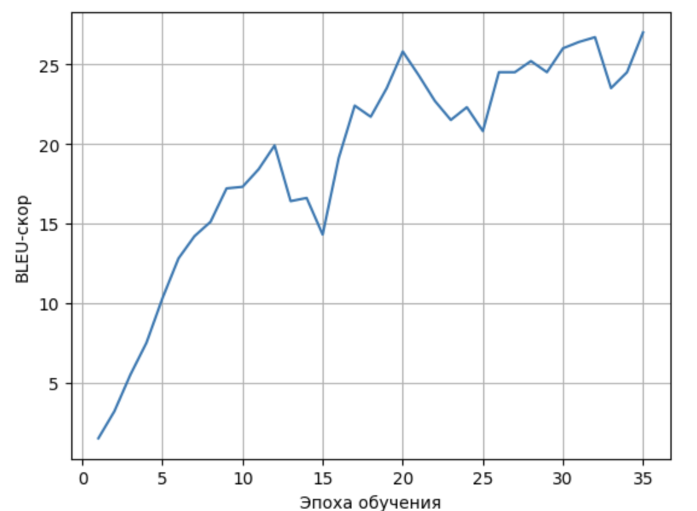

## Отчет по БДЗ-2

Я взял за основу туториал из pytorch: https://pytorch.org/tutorials/beginner/translation_transformer.html

И проводил различные эксперементы

##### 1 Вариант
* 3 слоя encoder и decoder
* emb_size = 128
* n_head = 8
* feed_forfard = 128
* dropout = 0.1
* epoch = 5

На public получился 7.49

##### 2 Вариант
* 3 слоя encoder и decoder
* emb_size = 256
* n_head = 8
* feedforward = 128
* dropout = 0.1
* epoch = 10
* Изменил токенизацию на пословную

На public получился 25.36

###### 3 вариант
* 3 слоя encoder и decoder
* emb_size = 512
* n_head = 8
* feedforward = 128
* dropout = 0.1
* epoch = 10
* batch_size = 128

Постоянно заканчивалась память, получилось обучить лишь 10 эпох

На public получился 24.57

###### 4 вариант

* 3 слоя encoder и decoder
* emb_size = 256
* n_head = 4
* feedforward = 512
* dropout = 0.15
* epoch = 18
* batch_size = 64

На public получился 25.56

###### 5 вариант

* 3 слоя encoder и decoder
* emb_size = 256
* n_head = 8
* feedforward = 512
* dropout = 0.1
* epoch = 20
* batch_size = 64

На public получился 25.43

###### 6 вариант (итоговый)

* 3 слоя encoder и decoder
* emb_size = 256
* n_head = 8
* feedforward = 1024
* dropout = 0.1
* epoch = 35
* batch_size = 64

На public получился 26.46
Дальнейшее обучение приводило к переобучению

